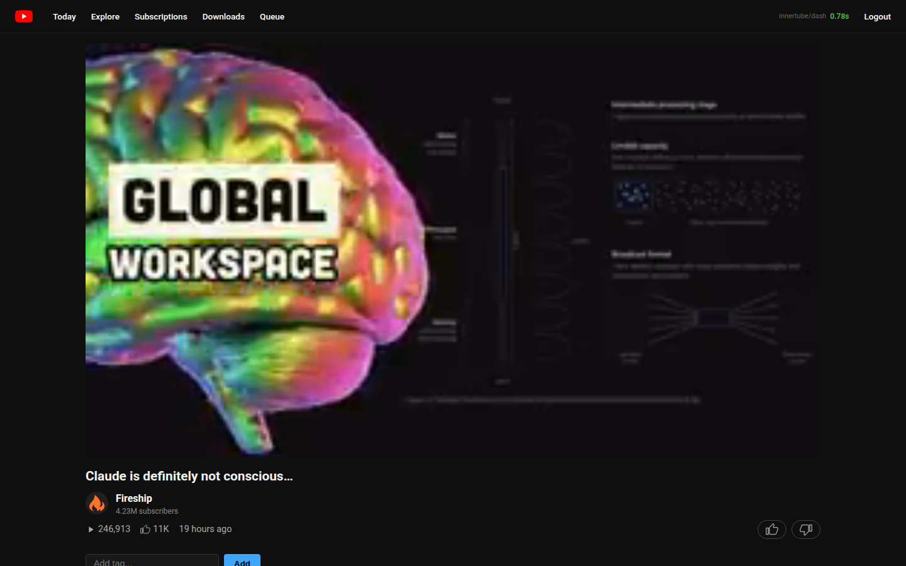

# Self-Hosted YouTube

A private, chronological subscription frontend whose server proxies streams,
thumbnails, and metadata so the browser never contacts Google directly.

[Portfolio case study](https://timcis.com/projects/my-youtube)



## Engineering goals

- Keep the browser-side privacy boundary explicit.
- Make every dependency beyond Node optional and swappable.
- Degrade to a useful single-process application when queue or object-storage
  infrastructure is unavailable.
- Test ingestion, playback, resilience, and deployment behavior independently.

## Architecture

The TypeScript/Express server owns subscription ingestion, extraction, media
proxying, caching, authentication, and playback metadata. Shaka Player handles
DASH playback in the browser.

The same codebase supports:

- SQLite or PostgreSQL.
- Local disk or S3-compatible object storage.
- In-process extraction or Redis/BullMQ workers.
- A single process or clustered web and worker replicas.
- Direct serving or Docker/Nginx/Varnish deployment.

## Run locally

Requirements: a current Node.js release, `yt-dlp`, and `ffmpeg`.

```sh
cp .env.example .env
npm ci
npm run dev
```

The optional PostgreSQL, Redis, S3, and worker settings are documented in
[`deploy/DEPLOY.md`](deploy/DEPLOY.md) and the compose files.

## Verification

```sh
npm run typecheck
npm run lint
npm run test:all
npm run test:player
npm run test:e2e
npm run test:pg
```

The suites are separated so local checks do not require every optional service.
PostgreSQL and browser/player coverage can run only when those dependencies are
available.

## Stack

TypeScript · Express · EJS · Shaka Player · SQLite/PostgreSQL · Redis/BullMQ ·
S3 · Playwright · Docker · Nginx · Varnish

## Scope

This is self-hosted personal software, not an official YouTube client. Operators
are responsible for their environment, credentials, network policy, and
compliance with services they connect to.
